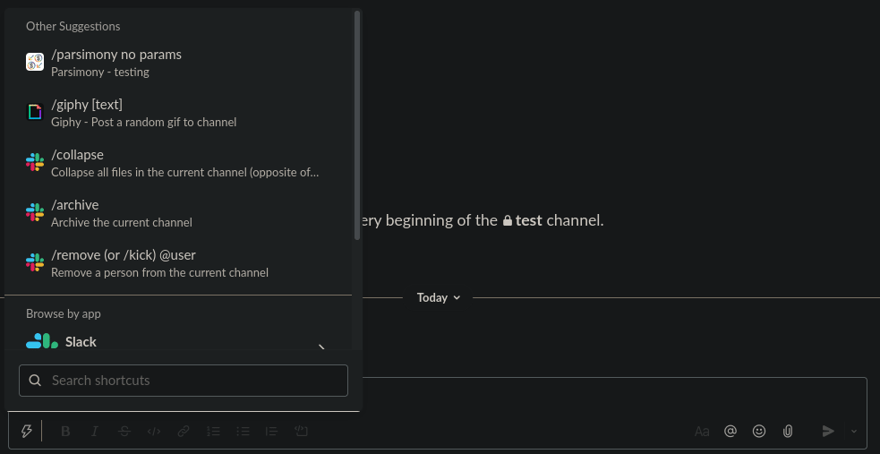

<!-- PROJECT SHIELDS -->
<!--
*** I'm using markdown "reference style" links for readability.
*** Reference links are enclosed in brackets [ ] instead of parentheses ( ).
*** See the bottom of this document for the declaration of the reference variables
*** for contributors-url, forks-url, etc. This is an optional, concise syntax you may use.
*** https://www.markdownguide.org/basic-syntax/#reference-style-links
-->
[![Contributors][contributors-shield]][contributors-url]
[![Forks][forks-shield]][forks-url]
[![Stargazers][stars-shield]][stars-url]
[![Issues][issues-shield]][issues-url]
[![MIT License][license-shield]][license-url]
[![LinkedIn][linkedin-shield]][linkedin-url]


<!-- PROJECT LOGO -->
<br />
<p align="center">
  <a href="https://github.com/wesleyorama2/parsimony">
    
  </a>

  <h3 align="center">Parsimony</h3>

  <p align="center">
    A slack bot to help you keep an eye on aws spend. 
    <br />
    <a href="https://github.com/wesleyorama2/parsimony"><strong>Explore the docs »</strong></a>
    <br />
    <br />
    <a href="https://github.com/wesleyorama2/parsimony/issues">Report Bug</a>
    ·
    <a href="https://github.com/wesleyorama2/parsimony/issues">Request Feature</a>
  </p>
</p>


<!-- TABLE OF CONTENTS -->
<details open="open">
  <summary>Table of Contents</summary>
  <ol>
    <li>
      <a href="#about-the-project">About The Project</a>
      <ul>
        <li><a href="#built-with">Built With</a></li>
      </ul>
    </li>
    <li>
      <a href="#getting-started">Getting Started</a>
      <ul>
        <li><a href="#prerequisites">Prerequisites</a></li>
        <li><a href="#installation">Installation</a></li>
      </ul>
    </li>
    <li><a href="#usage">Usage</a></li>
    <li><a href="#roadmap">Roadmap</a></li>
    <li><a href="#contributing">Contributing</a></li>
    <li><a href="#license">License</a></li>
    <li><a href="#contact">Contact</a></li>
    <li><a href="#acknowledgements">Acknowledgements</a></li>
  </ol>
</details>


<!-- ABOUT THE PROJECT -->
## About The Project
<!-- [![Product Name Screen Shot][product-screenshot]](https://example.com) -->

Keeping an eye on AWS spend is important for many people / teams. I wanted to write a slack bot to post a chart of aws spend on a schedule. 

### Built With
* [Python](https://python.com)
* [boto](https://aws.amazon.com/sdk-for-python/)
* [quickchart](https://quickchart.io)
* [bolt](https://api.slack.com/start/building/bolt-python)
* [ngrok](https://dashboard.ngrok.com/get-started/setup)


<!-- GETTING STARTED -->
## Getting Started

### Prerequisites
This is an example of how to list things you need to use the software and how to install them.
* Python
  [Python Downloads](https://www.python.org/downloads/)
* PIP3
  ```sh
  apt install python3-pip
  ```
* virtualenvwrapper
    * used [this](https://www.freecodecamp.org/news/how-to-set-up-python-virtual-environment-on-ubuntu-20-04/) as guide on setup.
  ```sh
  pip3 install virtualenvwrapper
  ```
* [ngrok](https://dashboard.ngrok.com/get-started/setup)

### Installation
#### Development
1. Create the virtual environment
   ```sh
   mkvirtualenv parsimony
   ```
2. Activate environment
   ```sh
   workon parsimony
   ```
3. Install python packages
   ```sh
   pip3 install -r requirements.txt
   ```
4. Start ngrok on port 3000
   ```sh
   ngrok http 3000
   ```


<!-- USAGE EXAMPLES -->
## Usage
*_NOTE: This is very early in the development of Parsimony_*
<p align="center">
  <a href="https://github.com/wesleyorama2/parsimony">
    
  </a>


<!-- ROADMAP -->
## Roadmap
See the [open issues](https://github.com/wesleyorama2/parsimony/issues) for a list of proposed features (and known issues).


<!-- CONTRIBUTING -->
## Contributing
Contributions are what make the open source community such an amazing place to be learn, inspire, and create. Any contributions you make are **greatly appreciated**.

1. Fork the Project
2. Create your Feature Branch (`git checkout -b feature/AmazingFeature`)
3. Commit your Changes (`git commit -m 'Add some AmazingFeature'`)
4. Push to the Branch (`git push origin feature/AmazingFeature`)
5. Open a Pull Request


<!-- LICENSE -->
## License
Distributed under the GNU General Public License v3.0. See `LICENSE` for more information.


<!-- CONTACT -->
## Contact
Project Link: [https://github.com/wesleyorama2/parsimony](https://github.com/wesleyorama2/parsimony)


<!-- ACKNOWLEDGEMENTS -->
## Acknowledgements
* [GitHub Emoji Cheat Sheet](https://www.webpagefx.com/tools/emoji-cheat-sheet)
* [Img Shields](https://shields.io)
* [Choose an Open Source License](https://choosealicense.com)
* [Best ReadMe Template](https://github.com/othneildrew/Best-README-Template/)


<!-- MARKDOWN LINKS & IMAGES -->
<!-- https://www.markdownguide.org/basic-syntax/#reference-style-links -->
[contributors-shield]: https://img.shields.io/github/contributors/wesleyorama2/parsimony.svg?style=for-the-badge
[contributors-url]: https://github.com/wesleyorama2/parsimony/graphs/contributors
[forks-shield]: https://img.shields.io/github/forks/wesleyorama2/parsimony.svg?style=for-the-badge
[forks-url]: https://github.com/wesleyorama2/parsimony/network/members
[stars-shield]: https://img.shields.io/github/stars/wesleyorama2/parsimony.svg?style=for-the-badge
[stars-url]: https://github.com/wesleyorama2/parsimony/stargazers
[issues-shield]: https://img.shields.io/github/issues/wesleyorama2/parsimony.svg?style=for-the-badge
[issues-url]: https://github.com/wesleyorama2/parsimony/issues
[license-shield]: https://img.shields.io/github/license/wesleyorama2/parsimony.svg?style=for-the-badge
[license-url]: https://github.com/wesleyorama2/parsimony/blob/master/LICENSE.txt
[linkedin-shield]: https://img.shields.io/badge/-LinkedIn-black.svg?style=for-the-badge&logo=linkedin&colorB=555
[linkedin-url]: https://linkedin.com/in/https://www.linkedin.com/in/cheesestick/
[product-screenshot]: images/screenshot.png
